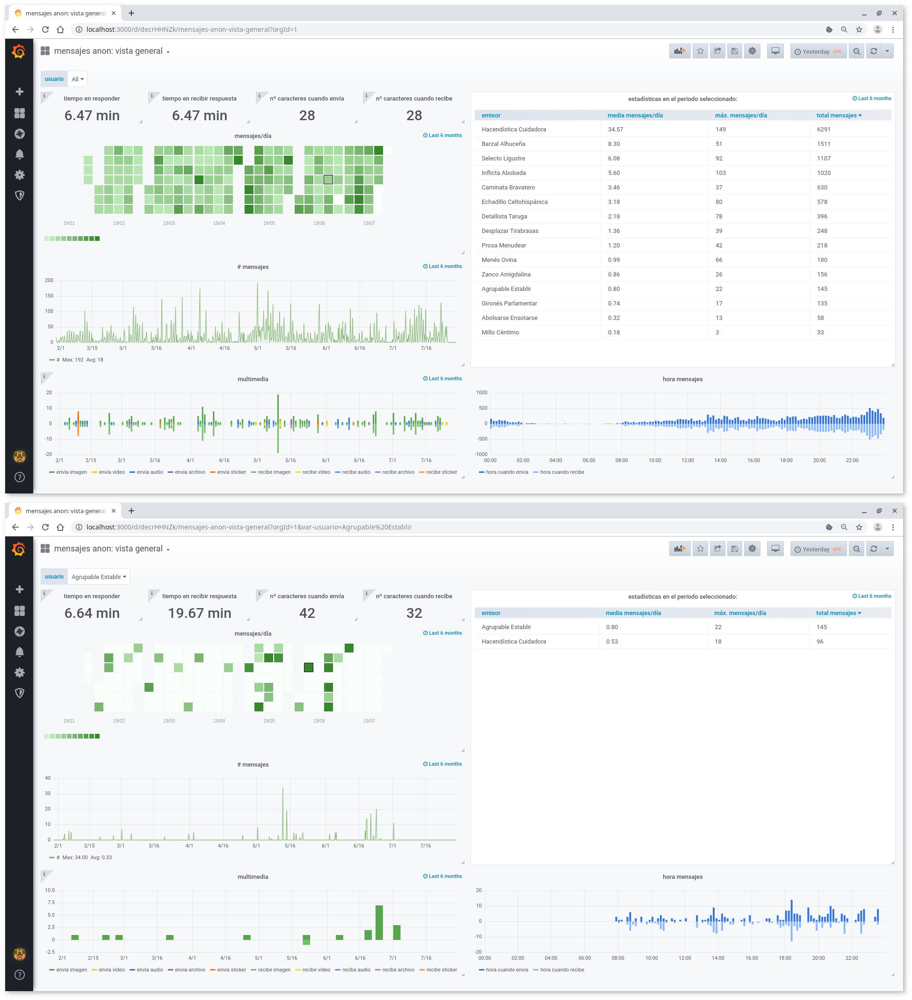

# whatsappParser
qué refleja tu uso de whatsapp? analízalo en local

## pasos

1- **instalar** [elasticsearch](https://www.elastic.co/guide/en/elasticsearch/reference/current/deb.html) y [grafana](https://grafana.com/docs/installation/debian/):  
```
bash install.sh
```

2- **[exportar chats](https://faq.whatsapp.com/en/wp/22548236)** de whatsapp con "incluir archivos" y guardar los `.txt` resultantes en `chats/`

3- **cargar** los datos:  
```
bash run.sh # run_anonymize.sh para cargarlos anonimizando los nombres
```

4- crear el **dashboard** de grafana:  
    * crear las *datasources* "msgs", "msgs_24h" y "mensajes". para la opción anonimizada, lo mismo pero acabando las *datasources* en "_anon"  
    * crear un nuevo **dashboard**, ir a "Dashboard settings" > "JSON Model" y pegar ahí `dashb.json` (para la opción anonimizada está `dashb-anon.json`  
    * actualizar la **variable $usuario**. se hace dentro de "Dashboard settings" > "Variables", abriendo las opciones de la variable y haciendo click sobre "Update". antes de entrar a los ajustes, en el filtro temporal se debe haber seleccionado "Last 6 months".  


